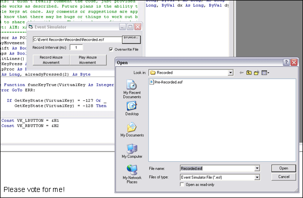



## Event Recorder \(Simulates Events\)

### Description

This little application records your mouse movements, clicks, and keypresses when turned on. When "played", it will simulate the mouse clicks, movement, and key presses you've made while it was being recorded. I have now updated the coding a bit to remove minor bugs and add more commenting on the code. The program does not currently recognize multiple-key presses but I plan to include that in the future.

Bugs, comments, and suggestions are greatly appreciated. Please vote for me! PS. This is my first submission so don't hate, =) Umm.. Need some more comments please!! Also check out my other submissions!
 
### More Info
 

             |
---                |---
**Submitted On**   |2004-12-24 10:00:04
**By**             |[Daniel M](https://github.com/Planet-Source-Code/PSCIndex/blob/master/ByAuthor/daniel-m.md)
**Level**          |Intermediate
**User Rating**    |4.4 (35 globes from 8 users)
**Compatibility**  |VB 6\.0
**Category**       |[Windows API Call/ Explanation](https://github.com/Planet-Source-Code/PSCIndex/blob/master/ByCategory/windows-api-call-explanation__1-39.md)
**World**          |[Visual Basic](https://github.com/Planet-Source-Code/PSCIndex/blob/master/ByWorld/visual-basic.md)
**Archive File**   |[Event\_Reco18330112242004\.zip](https://github.com/Planet-Source-Code/daniel-m-event-recorder-simulates-events__1-57882/archive/master.zip)

### API Declarations

Included in project.

